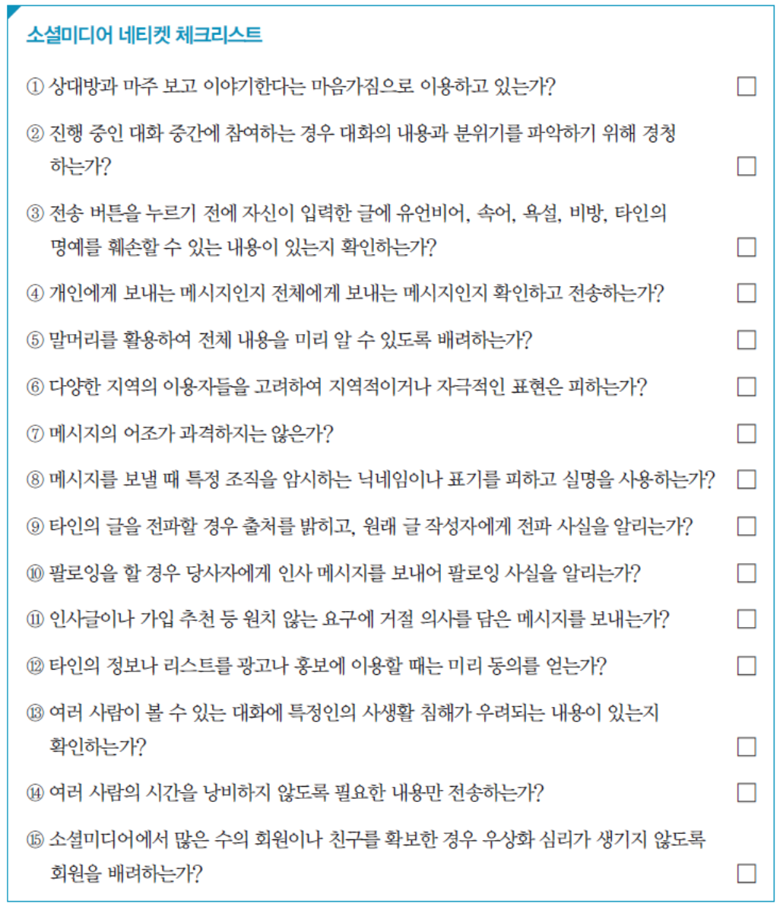

import { Callout } from "nextra/components";

# Chapter 2. 인터넷 예절, 네티켓

<Callout>2024년 3월 13일 (수) 20:10 ~ 21:40</Callout>

## 네티켓의 개념

### 네티켓이란?

네트워크 (Network) + 에티켓 (Etiquette)

**1990년대 중반**에 막 인터넷이 태동할 때 쓰이기 시작했음.

-> 2001년정도부터 학교 현장에서 교육이 시작됨

### 네티켓의 핵심 원칙

1. 상대가 인간임을 기억하라.
2. 실생활에 적용되는 기준과 행동을 지켜라.
3. 자신이 접속한 곳을 알고, 그 문화에 어울리게 행동하라.
4. 타인의 시간을 존중하라.
5. 온라인에서 자신을 근사하게 만들라.
6. 전문 지식을 공유하라.
7. **논쟁은 절제된 감정 아래 행하라.**
8. 타인의 사생활을 존중하라.
9. 자신의 권력을 남용하지 말라.
10. **타인의 실수를 용서하라**

### 청소년을 위한 네티켓 지침

- 하루에 ~~컴퓨터~~(**스마트폰**)를 이용하는 시간에 제한을 둔다.
- 여가 시간에 ~~컴퓨터~~(**스마트폰**)에만 몰입하지 않는다.
- 또래의 잘못된 ~~컴퓨터~~(**스마트폰**) 이용 습관을 따라 하지 않는다.
- 친구가 권하더라도 불건전 사이트는 당당하게 거부한다.
- 채팅(게임) 중에는 항상 예의를 지킨다.
- 채팅(게임) 중에는 욕설을 하지 않는다.
- 채팅(게임) 중 상대방이 자신을 모욕하면 채팅(게임)을 즉시 중지한다.
- 자신이 **가해자이자 동시에 피해자**가 될 수 있음을 알고 조심한다.
- 건전하고 유익한 정보를 서로 나누고 공유한다

## 네티켓의 분류

### 이메일을 사용할 때

- 자신의 이메일 비밀번호를 타인에게 절대 공개하지 않는다.
- 이메일을 보낼 때는 자신이 누군지를 먼저 밝히고 메시지는 되도록 짧게 작성한다.
- 이메일 제목은 내용을 알 수 있는 함축된 것으로 한다.
- 이메일을 보내기 전에 주소가 올바른지 확인하고 수신자와 참조자를 구분한다.
- **흥분한 상태에서는 이메일을 보내지 않는다.**
- 한 행의 길이가 너무 길지 않게 작성한다.
- 내용 끝에 사인, 직위, 단체명, 전화번호 등을 포함하되 네 줄을 초과하지 않는다.
- **타인에게 피해를 주는 비방이나 욕설 등은 보내지 않는다.**
- 행운의 편지나 메일 폭탄 등에 절대 현혹되지 않는다.
- **이메일을 받으면 회신을 할 것인지, 새 이메일로 보낼 것인지 판단하여 답장을 한다.** (단체 메일에 전체 답장 조심)

### 게시판을 사용할 때

- 게시글의 제목 맨 앞에 [부탁], [공지] 등을 넣어서 읽는 사람을 배려한다.
- 게시글은 주제를 먼저 드러내는 두괄식으로 쓰는 것이 좋다.
- **게시판에 글을 쓸 때는 존댓말을 사용하는 것이 기본이다.**
- 게시글에는 작성자의 이름과 아이디, 이메일 주소 등을 남긴다.
- 문법과 맞춤법에 맞는 표현을 사용하여 글을 쓴다.
- **사실과 다르거나 진위가 확인되지 않은 내용은 올리지 않는다.**
- **다른 사람을 욕하거나 비난하는 글은 올리지 않는다.**
- 다른 사람이 올린 글에 대해 지나치게 반박하지 않는다.
- 같은 글을 여러 번 반복해서 올리지 않는다.
- 내용을 잘 나타낼 수 있는 알맞은 제목을 붙인다.
- 자신의 생각만을 고집하여 타인에게 불쾌감을 주지 않도록 주의한다.

### 채팅 문화

- 마주 보고 이야기한다는 마음가짐으로 채팅을 한다.
- 채팅창에서도 만나고 헤어질 때는 인사를 한다.
- 중간에 대화방에 들어갔다면 지금까지 진행된 대화 내용과 분위기를 파악하기 위해 어느 정도 경청하는 것이 좋다.
- **동시에 여러 사람과 이야기할 때는 상대방을 혼동하지 않도록 조심**하고, 지극히 개인적인 논조의 대화는 피한다.
- 채팅을 광고나 홍보 등의 목적으로만 이용하지 않는다.
- **유언비어, 속어, 욕설 등을 사용하지 말고**, 타인을 비방하거나 명예를 훼손할 우려가 있는 내용은 언급하지 않는다.
- 상대방에게 불쾌감을 주는 대화를 하지 않는다.
- 불건전한 대화를 하지 않는다.
- **채팅을 하다 알게 된 사람을 함부로 만나지 않는다.**
- 사이버 공간이라도 진실만을 이야기한다.

### 모바일 네티켓

- 타인에게 불편을 줄 수 있는 장소(도서관, 강의실, 병원, 극장 등)와 **시간(수업, 회의, 업무 등)에는 사용을 자제**한다.
- 대중교통이나 공공장소에서 모바일 기기를 사용할 때는 소음으로 주위 사람들에게 피해를 주지 않도록 주의한다.
- 정보를 올릴 때는 건전한 자료를 제공한다.
- **자신의 정보와 사생활은 물론이고, 타인의 인격과 사생활도 존중하고 보호해야 한다.**
- 전화를 잘못 건 경우에는 반드시 사과를 하고 끊는다.
- 벨 소리나 캐릭터 등 모바일 기기를 꾸미는 데 너무 치중하지 않는다.
- 무분별한 모바일 이벤트 참여를 자제하고 **유료 정보 서비스 등을 지나치게 이용하지 않는다.**
- **모바일 기기의 디자인이나 기능으로 사람을 평가하지 않는다.**
- 실내에서 타인과 함께 있을 때 전화가 온 경우에는 가급적 밖으로 나가서 통화를 한다.

### 소셜미디어 네티켓

전 세계 인구 60% 이상이 SNS 사용? 한국은 최소 80% 이상 아닐까?

### 소셜미디어 종류

- 개방형 소셜미디어 서비스 : 페이스북, 트위터
- 폐쇄형 소셜미디어 서비스 : 디스코드, 카카오톡
- 휘발형 소셜미디어 서비스 : 텔레그램, 스냅챗

### SNS에 참여하는 이유

- ① SNS에 참여하는 이유
  - 자랑하고 싶은 것을 외부에 드러내기 위해
  - 궁금한 것을 다른 사람들에게 물어보고 정보를 얻기 위해
  - 다양한 소식과 정보를 주고받고 공유하기 위해
- ② SNS에 참여를 꺼리는 이유
  - SNS를 통한 사생활 노출이 두려워서
  - 개인 정보 유출로 인한 금융 피해가 염려되어서
  - SNS 참여와 관리에 시간을 투자하는 것이 낭비라고 여겨져서
  - 참여하지 않으면 소외될 것 같아서? (추가된 부분)

### 소셜미디어 서비스 이용시 주의사항

- 친구 신청, 수락, 거절 신중하게
- 수업 시간에는 X
- 사진 올리거나 할 때 다른 사람 있으면 조심 (동의를 받거나?)

### 체크리스트

- 4, 9, 13번 교수님이 중요하다고 찝었음
